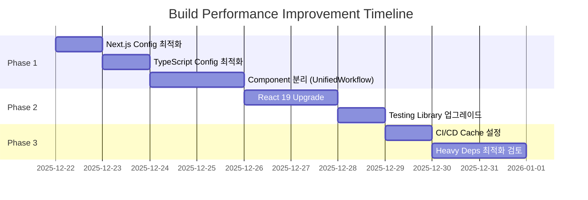

# Build Performance Improvement Plan

**Date**: 2025-12-21  
**Based on**: [build-performance-analysis.md](file:///c:/GitHub/wine/docs/build-performance-analysis.md)

---

## Executive Summary

이 문서는 Wine Tracker 프로젝트의 빌드 성능 개선을 위한 단계별 실행 계획을 정의합니다.  
분석 결과 확인된 4가지 근본 원인을 해결하기 위해 **3단계 개선 전략**을 제안합니다.

> [!IMPORTANT]
> 각 단계는 **검증 → 개선 → 테스트** 사이클을 따르며, 이전 단계 완료 후 다음 단계 진행을 권장합니다.
> 특히 주니어 개발자는 각 단계의 **[Senior Developer's Advisory]** 섹션을 반드시 숙지하십시오.

---

## Root Causes Summary

| 원인 | 영향도 | 해결 우선순위 |
|------|--------|--------------|
| Heavy Server-side Dependencies | 🔴 High | Phase 1 |
| Version Mismatch (Next.js 15 + React 18) | 🟠 Medium | Phase 2 |
| File System Overhead (Windows + 11K+ files) | 🟡 Low | Phase 3 |
| Component Complexity (Monolithic files) | 🟠 Medium | Phase 1 |

---

## Phase 1: Quick Wins (1-2 Days)

> [!TIP]
> 이 단계는 코드 변경이 최소화되며 즉각적인 효과를 기대할 수 있습니다.

> [!CAUTION]
> **Senior Developer's Advisory (Phase 1):**
> 1. **재시작 필수**: `next.config.js`나 `tsconfig.json` 수정 후에는 반드시 개발 서버를 재시작해야 반영됩니다.
> 2. **타입 에러 주의**: `tsconfig.json`의 `exclude`에 필요한 폴더(예: `types`, `lib`)가 포함되지 않도록 주의하세요. 수정 후 즉시 `npm run type-check`를 수행하십시오.

### 1.1 Next.js Config 최적화

**Target File**: [next.config.js](file:///c:/GitHub/wine/next.config.js)

#### Current State
```javascript
experimental: {
  esmExternals: true,
}
```

#### Proposed Changes
```diff
experimental: {
  esmExternals: true,
+ optimizePackageImports: [
+   '@google-cloud/vision',
+   'googleapis',
+   '@google/generative-ai',
+   '@google/genai'
+ ],
}
```

**Expected Impact**: Heavy dependency의 tree-shaking 최적화로 초기 번들링 시간 10-20% 감소

---

### 1.2 TypeScript Config 최적화

**Target File**: [tsconfig.json](file:///c:/GitHub/wine/tsconfig.json)

#### Current State
```json
"exclude": [
  "node_modules",
  "__tests__",
  "**/*.test.ts",
  "**/*.test.tsx",
  "**/*.spec.ts",
  "**/*.spec.tsx"
]
```

#### Proposed Changes
```diff
"exclude": [
  "node_modules",
  "__tests__",
  "**/*.test.ts",
  "**/*.test.tsx",
  "**/*.spec.ts",
  "**/*.spec.tsx",
+ "coverage",
+ "playwright-report",
+ "logs",
+ "tmp",
+ "uploads",
+ "docs"
]
```

**Expected Impact**: 불필요한 폴더 제외로 타입 체크 시간 5-10% 감소

---

### 1.3 Component 분리 (High Priority)

> [!WARNING]
> 큰 컴포넌트 파일은 HMR 속도와 빌드 시간에 직접적인 영향을 줍니다.

**현재 대형 컴포넌트 목록**:

| Component | Size | Priority |
|-----------|------|----------|
| [UnifiedWorkflow.tsx](file:///c:/GitHub/wine/components/UnifiedWorkflow.tsx) | 12.35 KB | 🔴 High |
| [WineBatchResultDisplay.tsx](file:///c:/GitHub/wine/components/WineBatchResultDisplay.tsx) | 12.04 KB | 🔴 High |
| [WineInfoCard.tsx](file:///c:/GitHub/wine/components/WineInfoCard.tsx) | 10.76 KB | 🟠 Medium |
| [WineDataEditForm.tsx](file:///c:/GitHub/wine/components/WineDataEditForm.tsx) | 9.14 KB | 🟠 Medium |

#### Proposed Refactoring Structure

```
components/
├── UnifiedWorkflow/
│   ├── index.tsx           # Main component (re-export)
│   ├── WorkflowHeader.tsx
│   ├── WorkflowSteps.tsx
│   ├── WorkflowActions.tsx
│   └── hooks/
│       └── useWorkflowState.ts
├── WineBatchResult/
│   ├── index.tsx
│   ├── BatchHeader.tsx
│   ├── BatchItemList.tsx
│   ├── BatchItemCard.tsx
│   └── BatchSummary.tsx
└── ... (other components)
```

**Expected Impact**: 
- HMR 속도 30-50% 개선
- 빌드 시 병렬 처리 효율 증가

> [!IMPORTANT]
> **컴포넌트 분리 가이드 (For Juniors):**
> - **Hook 먼저**: 분리 전 로직을 `custom hook`으로 먼저 추출하면 의존 파악이 쉽습니다.
> - **Props Drilling 방지**: 3단계 이상의 깊은 Props 전달이 예상되면 Context API나 상태 관리 라이브러리 도입을 검토하세요.
> - **순환 참조 주의**: `A <-> B` 상호 참조가 발생하지 않도록 폴더 구조를 설계하세요.

---

## Phase 2: Version Alignment (2-3 Days)

> [!CAUTION]
> React 19 업그레이드는 Breaking Changes가 있으므로 충분한 테스트가 필요합니다.

> [!WARNING]
> **Senior Developer's Advisory (Phase 2):**
> 1. **No `--force`**: 의존성 충돌 시 `--force`를 쓰지 말고, 어떤 라이브러리가 React 19를 지원하지 않는지 분석하여 대응하세요.
> 2. **Hydration 에러**: React 19는 서버-클라이언트 불일치에 엄격합니다. 브라우저 콘솔의 Hydration 경고를 무시하지 마십시오.

### 2.1 React 19 Upgrade

**Target File**: [package.json](file:///c:/GitHub/wine/package.json)

#### Pre-upgrade Checklist
- [ ] 모든 Jest/Testing-library 테스트 통과 확인
- [ ] Playwright E2E 테스트 통과 확인
- [ ] 현재 빌드 시간 baseline 측정
- [ ] git branch 분기 (`feature/react-19-upgrade`)

#### Proposed Changes
```diff
"dependencies": {
-  "react": "^18",
-  "react-dom": "^18",
+  "react": "^19",
+  "react-dom": "^19",
}

"devDependencies": {
-  "@types/react": "^18",
-  "@types/react-dom": "^18",
+  "@types/react": "^19",
+  "@types/react-dom": "^19",
}
```

#### Upgrade Steps
1. 현재 `node_modules` 및 `.next` 삭제
2. `package.json` 수정
3. `npm install` 실행
4. 모든 테스트 실행 및 수정
5. 빌드 시간 비교 측정

**Expected Impact**: 
- Next.js 15와의 완전한 호환으로 빌드 최적화 극대화
- 예상 빌드 시간 15-25% 감소

---

### 2.2 @testing-library/react 업그레이드

React 19 업그레이드 시 testing-library도 함께 업데이트 필요:

```diff
"devDependencies": {
-  "@testing-library/react": "^13.4.0",
+  "@testing-library/react": "^16.0.0",
}
```

---

## Phase 3: Infrastructure Optimization (3-5 Days)

### 3.1 CI/CD Build Cache 설정

#### Vercel (현재 배포 환경)
Vercel은 기본적으로 `.next/cache`를 자동 캐싱합니다. 추가 설정 불필요.

#### GitHub Actions (필요시)
```yaml
# .github/workflows/build.yml
- name: Cache Next.js Build
  uses: actions/cache@v4
  with:
    path: |
      ${{ github.workspace }}/.next/cache
    key: ${{ runner.os }}-nextjs-${{ hashFiles('**/package-lock.json') }}-${{ hashFiles('**/*.js', '**/*.jsx', '**/*.ts', '**/*.tsx') }}
    restore-keys: |
      ${{ runner.os }}-nextjs-${{ hashFiles('**/package-lock.json') }}-
```

**Expected Impact**: CI/CD 빌드 시간 40-60% 감소 (캐시 hit 시)

---

### 3.2 Heavy Dependencies 분리 검토

> [!NOTE]
> 장기적 관점에서 검토할 사항입니다. 현재 구조에서는 큰 변경이 필요하지 않을 수 있습니다.

#### Option A: Lazy Import (권장)
```typescript
// Before
import { GoogleGenerativeAI } from '@google/generative-ai';

// After
const getGeminiClient = async () => {
  const { GoogleGenerativeAI } = await import('@google/generative-ai');
  return new GoogleGenerativeAI(process.env.GEMINI_API_KEY!);
};
```

#### Option B: Microservice 분리 (대규모 시스템용)
- Vision API → 별도 AWS Lambda / Cloud Function
- Gemini API → 별도 서버리스 함수
- **현재 규모에서는 오버엔지니어링 가능성 높음**

> [!CAUTION]
> **Senior Developer's Advisory (Phase 3):**
> - **Context Check**: `next/dynamic` 사용 시 클라이언트 전용 라이브러리를 서버에서 불러오지 않도록 `{ ssr: false }` 옵션 등을 적절히 활용하세요.

---

## Verification Plan

### Phase별 측정 항목

| Metric | Baseline | Phase 1 Target | Phase 2 Target | Phase 3 Target |
|--------|----------|----------------|----------------|----------------|
| Cold Build | ~45s | ~38s | ~32s | ~28s |
| Incremental Build | ~15s | ~12s | ~10s | ~8s |
| HMR Refresh | ~3s | ~2s | ~1.5s | ~1s |
| Type Check | ~8s | ~6s | ~5s | ~5s |

### 측정 방법
```powershell
# Cold Build 측정
Remove-Item -Recurse -Force .next
Measure-Command { npm run build }

# Incremental Build 측정 (파일 수정 후)
Measure-Command { npm run build }

# Type Check 측정
Measure-Command { npm run type-check }
```

### Cold Build 측정 프로토콜
정확한 성능 측정을 위해 아래 절차를 준수하세요:
1. `.next` 및 `node_modules/.cache` 폴더 삭제
2. 백그라운드 프로세스 최소화
3. **최소 3회 반복 측정 후 평균값** 기록 (캐시에 의한 일시적 성성 향상 방지)

---

## Risk Assessment

| Risk | Likelihood | Impact | Mitigation |
|------|------------|--------|------------|
| React 19 호환성 이슈 | Medium | High | 충분한 테스트, 별도 브랜치 작업 |
| 컴포넌트 분리 시 버그 | Low | Medium | 단위 테스트 추가, 점진적 분리, Hook 추출 선진행 |
| CI 캐시 무효화 | Low | Low | 캐시 키 전략 최적화 |
| 의존성 충돌 시 강제 설치 | Medium | High | `--force` 사용 금지 가이드, Peer Deps 분석 |
| 순환 참조 및 빌드 에러 | Low | Medium | 컴포넌트 설계 리뷰, `index.ts` 활용 최적화 |
| 잘못된 성능 수치 보고 | Medium | Low | Cold Build 프로토콜 준수 (3회 측정) |

---

## Implementation Timeline



---

## Next Steps

1. [ ] Phase 1 실행 승인
2. [ ] Baseline 빌드 시간 측정 및 기록
3. [ ] 각 Phase 완료 후 성능 측정 및 비교

---

## Change History

| Date | Version | Author | Changes |
|------|---------|--------|---------|
| 2025-12-21 | 1.0 | Agent | 초기 계획 문서 작성 |
| 2025-12-21 | 1.1 | Agent | 시니어 개발자 피드백 및 리스크 가이드 추가 |
