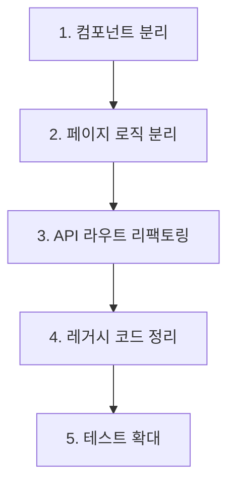

# Wine Tracker 리팩토링 - 남은 작업 계획 (Senior Guide)

> 작성일: 2025-12-21  
> 현재 상태: Phase 1 기반 작업 완료  
> **최종 수정: 2025-12-21 (시니어 리뷰 반영 - 타입 정교화 및 실수 방지 가이드 추가)**

---

## 완료된 작업 요약

| 항목 | 파일 | 상태 |
|------|------|------|
| 타입 시스템 통합 | `types/index.ts` | ✅ 완료 |
| 유틸리티 추출 | `lib/utils/formatters.ts` | ✅ 완료 |
| 기존 모듈 업데이트 | `notion-schema.ts`, `api-types.ts` | ✅ 완료 |

---

## 공통 규칙

> [!IMPORTANT]
> **시니어 개발자가 강조하는 필수 규칙**
> 1. **No `any`**: 새로 생성하는 컴포넌트와 훅에서는 `any` 타입을 절대 사용하지 말 것. `types/index.ts`에 정의된 타입을 최대한 활용할 것.
> 2. **Props 인터페이스 엄수**: 명세된 Props 인터페이스를 변경해야 할 경우, 반드시 수정 전 사유와 함께 시니어에게 승인을 받을 것.
> 3. **불변성(Immutability) 유지**: 상태 업데이트 시 스프레드 연산자(`...`)를 사용하여 기존 상태를 직접 수정하지 않도록 주의할 것.
> 4. **컴포넌트 독립성**: 추출한 컴포넌트는 부모 컴포넌트(`WineBatchResultDisplay`)의 상태에 의존하지 않고 오직 Props로만 통신할 것.

---

## 남은 작업

### 1. 컴포넌트 분리 (우선순위: 높음)

#### 대상: [WineBatchResultDisplay.tsx](file:///c:/GitHub/wine/components/WineBatchResultDisplay.tsx)
- **현재**: 961줄, 24개 함수
- **목표**: 3-4개 컴포넌트로 분리

---

#### 1.1 WineInfoCard.tsx

**파일 경로**: `components/WineInfoCard.tsx`

```typescript
import { ImageProcessingItem } from '@/types';

// Props 인터페이스 (변경 금지)
interface WineInfoCardProps {
  item: ImageProcessingItem; // 기존 'wine'에서 'item'으로 타입 정교화
  isSelected: boolean;
  isProcessing: boolean;
  onSelect: (id: string, checked: boolean) => void;
  onEdit: (id: string) => void;
  onDelete: (id: string) => void;
}

// 컴포넌트 시그니처
export const WineInfoCard: React.FC<WineInfoCardProps> = ({ 
  item, 
  isSelected, 
  isProcessing, 
  onSelect, 
  onEdit, 
  onDelete 
}) => { ... }
```

**추출 대상 함수**: `renderWineInfo()`의 카드 렌더링 부분

> [!TIP]
> **주니어 실수 방지 포인트**:
> - `item.extractedData`가 `null`일 경우에 대한 방어 로직을 반드시 포함하세요.
> - `formatKRW` 등은 `lib/utils/formatters.ts`에서 가져와 사용하세요.

**완료 기준 (DoD)**:
- [ ] `ImageProcessingItem` 타입을 활용하여 Props 구현
- [ ] 기존 `renderWineInfo()` 로직과 동일한 UI 출력 (Tailwind 클래스 누락 주의)
- [ ] 선택/편집/삭제 콜백 normal 작동 및 상태 전파 확인
- [ ] 타입 체크 통과: `npm run type-check`

---

#### 1.2 WineEditForm.tsx

**파일 경로**: `components/WineEditForm.tsx`

```typescript
import { NotionWineProperties } from '@/types';

// Props 인터페이스 (변경 금지)
interface WineEditFormProps {
  initialData: NotionWineProperties;
  onSave: (updatedData: NotionWineProperties) => void;
  onCancel: () => void;
  isSubmitting: boolean;
}

// 컴포넌트 시그니처
export const WineEditForm: React.FC<WineEditFormProps> = ({
  initialData,
  onSave,
  onCancel,
  isSubmitting
}) => { ... }
```

**추출 대상 함수**: `renderEditingForm()`

> [!IMPORTANT]
> **시니어 코칭**:
> - 내부 상태(`useState`)를 사용할 때 `initialData`로부터 초기값을 생성하되, `useEffect`로 초기값이 변경될 때 상태를 업데이트할지 여부를 결정하세요. (일반적으로는 비제어 컴포넌트로 시작하는 것이 깔끔합니다.)
> - 와인 이름, 빈티지 등 필수 항목에 대한 HTML5 유효성 검사(`required`)를 활용하세요.

**완료 기준 (DoD)**:
- [ ] `NotionWineProperties` 타입을 사용하여 데이터 모델링
- [ ] 폼 유효성 검사 로직 포함 (금액 필드 숫자 입력 제한 등)
- [ ] 저장/취소 버튼 클릭 시 부모의 핸들러 매핑 확인
- [ ] 기존 편집 폼 대비 UI/UX 변경 없을 것

---

#### 1.3 ManualWineForm.tsx

**파일 경로**: `components/ManualWineForm.tsx`

```typescript
import { NotionWineProperties } from '@/types';

// Props 인터페이스 (변경 금지)
interface ManualWineFormProps {
  onSubmit: (data: NotionWineProperties) => void;
  onCancel: () => void;
  isSubmitting: boolean;
  defaultValues?: Partial<NotionWineProperties>;
}
```

**추출 대상 함수**: `renderManualWineForm()`

**완료 기준 (DoD)**:
- [ ] 필수 필드(`Name`, `Vintage`, `Price`) 검증 로직 구현
- [ ] `Varietal(품종)` 입력 시 쉼표로 구분하여 배열로 변환하는 로직 포함
- [ ] 폼 제출 시 `NotionWineProperties` 형식에 맞게 데이터 가공

---

#### 1.4 hooks/useWineSelection.ts

**파일 경로**: `hooks/useWineSelection.ts`

```typescript
// 반환 타입 (변경 금지)
interface UseWineSelectionReturn {
  selectedIds: Set<string>;
  isSelected: (id: string) => boolean;
  toggleSelection: (id: string) => void;
  selectAll: (ids: string[]) => void;
  clearSelection: () => void;
  selectedCount: number;
}

// 훅 시그니처
export function useWineSelection(initialIds?: string[]): UseWineSelectionReturn { ... }
```

**완료 기준 (DoD)**:
- [ ] 반환 타입 정확히 구현
- [ ] 모든 함수 순수 함수로 구현 (side effect 없음)
- [ ] 타입 체크 통과

---

#### 1.5 최종 통합

**작업 순서** (반드시 순서대로 진행):
1. `WineInfoCard.tsx` 생성 → `WineBatchResultDisplay.tsx`의 한 부분만 교체하여 렌더링 테스트
2. `WineEditForm.tsx` 생성 → 독립적인 스토리북이나 임시 페이지에서 동작 확인
3. `ManualWineForm.tsx` 생성 → 폼 데이터 직렬화 테스트
4. `useWineSelection.ts` 생성 → `console.log`로 선택 세트 변화 추적
5. `WineBatchResultDisplay.tsx`에서 모든 로직 제거 및 새 컴포넌트/훅으로 교체
6. 전체 회귀 테스트 (Regression Test)

> [!CAUTION]
> **주니어 필독**: 5단계에서 대규모 삭제가 발생합니다. 반드시 `git stash` 또는 브랜치 백업을 완료한 후 진행하세요. 기존의 `convertToNotionFormat` 같은 도우미 함수들도 위치를 옮겨야 할 수 있으니 꼼꼼히 체크하세요.

---

### 2. 페이지 로직 분리 (우선순위: 중간)

#### 대상: [pages/index.tsx](file:///c:/GitHub/wine/pages/index.tsx)
- **현재**: 902줄, 20개 함수
- **목표**: 커스텀 훅으로 로직 분리

---

#### 2.1 hooks/useImageUpload.ts

**파일 경로**: `hooks/useImageUpload.ts`

```typescript
// 설정 타입
interface ImageUploadConfig {
  maxFileSize: number;      // bytes, 기본값: 10 * 1024 * 1024 (10MB)
  allowedTypes: string[];   // 기본값: ['image/jpeg', 'image/png', 'image/webp']
  maxFiles: number;         // 기본값: 10
}

interface UploadResult {
  file: File;
  preview: string;
}

// 반환 타입 (변경 금지)
interface UseImageUploadReturn {
  // 상태
  isUploading: boolean;
  error: string | null;
  
  // 액션
  // files를 받아서 유효성 검사 후, 미리보기 생성 및 업로드 처리 결과를 반환
  // 상태 저장은 이 훅을 호출하는 부모 컴포넌트(Page)가 담당
  uploadFiles: (files: File[]) => Promise<UploadResult[]>;
  resetError: () => void;
}
```

**추출 대상**: `handleImageUpload`, `handleMultipleImageUpload`

> [!IMPORTANT]
> **State Lifting Up (상태 끌어올리기)**:
> `useImageUpload`는 자체적으로 `items` 상태를 가지지 않습니다. 오직 파일 유효성 검사와 업로드 프로세스만 담당하고, 결과(`UploadResult`)를 반환하면 페이지 컴포넌트가 이를 받아 `items` 상태에 추가하는 구조여야 합니다. 이 원칙을 어기면 상태 동기화 문제가 발생합니다.

**완료 기준 (DoD)**:
- [ ] `items` 상태 제거하고 순수하게 업로드 기능만 제공
- [ ] 파일 크기/타입 검증 로직 포함
- [ ] 에러 메시지 형식 준수

---

#### 2.2 hooks/useWineAnalysis.ts

**파일 경로**: `hooks/useWineAnalysis.ts`

```typescript
import { ImageProcessingItem } from '@/types';

// 반환 타입 (변경 금지)
interface UseWineAnalysisReturn {
  // 상태
  isAnalyzing: boolean;
  error: string | null;
  
  // 액션
  // 분석이 완료되면 결과만 반환하거나, 콜백을 통해 상태 업데이트
  analyzeBatch: (items: ImageProcessingItem[]) => Promise<void>; // 내부에서 상태 업데이트 콜백 호출 필요
  analyzeRetry: (item: ImageProcessingItem) => Promise<void>;
}
```

**추출 대상**: `handleBatchAnalyze`, `handleRetryAnalysis`

> [!CAUTION]
> **상태 관리 주의**: `useWineAnalysis` 함수들은 `items` 전체 배열을 인자로 받거나, 분석할 타겟을 인자로 받아야 합니다. **이 훅 내부에서 전역 `items` 상태를 직접 수정하려 하지 마세요.** `analyzeBatch`는 비동기 작업만 수행하고, 상태 변경은 `onUpdateItem` 같은 콜백을 통해 이루어져야 합니다.

**완료 기준 (DoD)**:
- [ ] `items` 상태 의존성 제거 (인자로 데이터 수신)
- [ ] API 호출 실패 시 재시도 로직 구현
- [ ] 에러 처리 강화

---

#### 2.3 hooks/useNotionSave.ts

**파일 경로**: `hooks/useNotionSave.ts`

```typescript
// 저장 결과 타입
interface SaveResult {
  success: boolean;
  savedId?: string;
  error?: string;
}

import { NotionWineProperties, NotionSaveResult } from '@/types';

// 반환 타입 (변경 금지)
interface UseNotionSaveReturn {
  // 상태
  isSaving: boolean;
  saveProgress: {
    current: number;
    total: number;
  };
  
  // 액션
  // Note: 저장 성공 시 해당 아이템의 status를 'saved'로 변경하고 notionResult를 채워야 함
  saveAll: (items: ImageProcessingItem[]) => Promise<void>;
  saveSelected: (items: ImageProcessingItem[], selectedIds: string[]) => Promise<void>;
  saveIndividual: (itemId: string, data: NotionWineProperties) => Promise<boolean>;
}
```

**추출 대상**: `handleSaveAll`, `handleSaveSelected`, `handleSaveIndividual`

**완료 기준 (DoD)**:
- [ ] 반환 타입 정확히 구현
- [ ] API 호출: `POST /api/notion`
- [ ] 부분 실패 시에도 성공한 항목은 결과에 포함

---

### 3. API 라우트 리팩토링 (우선순위: 중간)

#### 대상: [pages/api/process.ts](file:///c:/GitHub/wine/pages/api/process.ts)
- **현재**: 426줄, 377줄짜리 단일 핸들러
- **목표**: 기능별 분리

---

#### 3.1 lib/services/wine-processor.ts

**파일 경로**: `lib/services/wine-processor.ts`

```typescript
// 처리 옵션
interface ProcessOptions {
  useGemini: boolean;       // 기본값: true
  enhanceWithSearch: boolean; // 기본값: false
  timeout: number;          // ms, 기본값: 30000
}

// 처리 결과
interface ProcessResult {
  success: boolean;
  wine?: Wine;
  rawResponse?: string;
  error?: string;
  processingTime: number;   // ms
}

// 서비스 클래스
export class WineProcessor {
  constructor(private options: Partial<ProcessOptions> = {}) {}
  
  async processImage(imageUrl: string): Promise<ProcessResult> { ... }
  async processBatch(imageUrls: string[]): Promise<ProcessResult[]> { ... }
}
```

**완료 기준 (DoD)**:
- [ ] 클래스 인터페이스 정확히 구현
- [ ] 기존 process.ts의 Gemini 호출 로직 이전
- [ ] 에러 시 `ProcessResult.error`에 상세 메시지 포함

---

#### 3.2 파일 업로드 핸들러 분리

**위치**: `pages/api/process.ts` 내부 함수

```typescript
// 핸들러 시그니처 (변경 금지)
async function handleFileUpload(
  req: NextApiRequest
): Promise<{ imageUrls: string[]; error?: string }> { ... }

async function handleJsonRequest(
  req: NextApiRequest
): Promise<{ imageUrls: string[]; error?: string }> { ... }
```

**완료 기준 (DoD)**:
- [ ] multipart/form-data 파싱: `formidable` 사용
- [ ] JSON 요청: `req.body.images` 배열 처리
- [ ] 파일 저장 경로: `/tmp/wine-uploads/`

---

### 4. 레거시 코드 정리 (우선순위: 낮음)

#### 대상 파일들:

| 파일 | 제거 대상 | 주의사항 |
|------|-----------|----------|
| `lib/notion.ts` | `WineData`, `ReceiptData` 인터페이스 | `types/index.ts`의 `Wine` 타입으로 대체 |
| `lib/gemini.ts` | `refineWineDataWithGemini` 함수 | `GeminiService.refine()` 메서드로 통합 |

> [!WARNING]
> **레거시 제거 전 체크리스트**:
> - [ ] `grep -r "WineData" .` 실행하여 사용처 0건 확인
> - [ ] `grep -r "refineWineDataWithGemini" .` 실행하여 사용처 0건 확인
> - [ ] 제거 후 `npm run build` 성공 확인

---

### 5. 테스트 커버리지 확대 (우선순위: 낮음)

#### 5.1 gemini.test.ts

**파일 경로**: `__tests__/gemini.test.ts`

| 테스트 케이스 | 입력 | 기대 결과 |
|--------------|------|-----------|
| 정상 와인 이미지 분석 | 유효한 이미지 URL | `Wine` 객체 반환 |
| 빈 이미지 URL | `""` | `throw Error("INVALID_URL")` |
| API 타임아웃 | 30초 초과 응답 | `throw Error("TIMEOUT")` |
| 잘못된 이미지 형식 | `.txt` 파일 URL | `throw Error("INVALID_IMAGE")` |
| Rate Limit 초과 | 429 응답 | 자동 재시도 후 성공 또는 에러 |

**Mocking 전략**:
```typescript
// Gemini API mock
jest.mock('@google/generative-ai', () => ({
  GoogleGenerativeAI: jest.fn().mockImplementation(() => ({
    getGenerativeModel: jest.fn().mockReturnValue({
      generateContent: jest.fn()
    })
  }))
}));
```

---

#### 5.2 formatters.test.ts

**파일 경로**: `__tests__/formatters.test.ts`

| 함수 | 입력 | 기대 출력 |
|------|------|-----------|
| `formatKRW(10000)` | `10000` | `"₩10,000"` |
| `formatKRW(0)` | `0` | `"₩0"` |
| `formatKRW(-1000)` | `-1000` | `"-₩1,000"` |
| `formatDate(new Date('2025-01-01'))` | Date 객체 | `"2025-01-01"` |
| `formatDate(null)` | `null` | `"-"` |

---

#### 5.3 process-api.test.ts

**파일 경로**: `__tests__/api/process-api.test.ts`

| 테스트 케이스 | HTTP 요청 | 기대 응답 |
|--------------|-----------|-----------|
| 정상 이미지 처리 | `POST /api/process` + 이미지 | `200` + Wine 배열 |
| 빈 요청 | `POST /api/process` + `{}` | `400` + 에러 메시지 |
| 잘못된 메서드 | `GET /api/process` | `405` |
| 파일 크기 초과 | 15MB 이미지 | `413` + 에러 메시지 |

---

## 작업 우선순위 요약



---

## 예상 소요 시간

| 작업 | 예상 시간 |
|------|----------|
| 컴포넌트 분리 | 2-3시간 |
| 페이지 로직 분리 | 1-2시간 |
| API 라우트 리팩토링 | 1-2시간 |
| 레거시 코드 정리 | 30분-1시간 |
| 테스트 커버리지 확대 | 1-2시간 |
| **총 예상** | **5-10시간** |

---

## 실행 명령어

각 작업 후 검증:
```powershell
# 타입 체크
npm run type-check

# 빌드 테스트
npm run build

# 단위 테스트
npm test
```

---

## 코드 리뷰 체크리스트

PR 제출 전 아래 항목 확인:

- [ ] 명세된 인터페이스를 그대로 사용했는가?
- [ ] 완료 기준(DoD)의 모든 항목을 충족했는가?
- [ ] `npm run type-check` 통과했는가?
- [ ] `npm run build` 성공했는가?
- [ ] 기존 기능과 동일하게 동작하는가?
- [ ] 콘솔 에러/워닝이 없는가?
